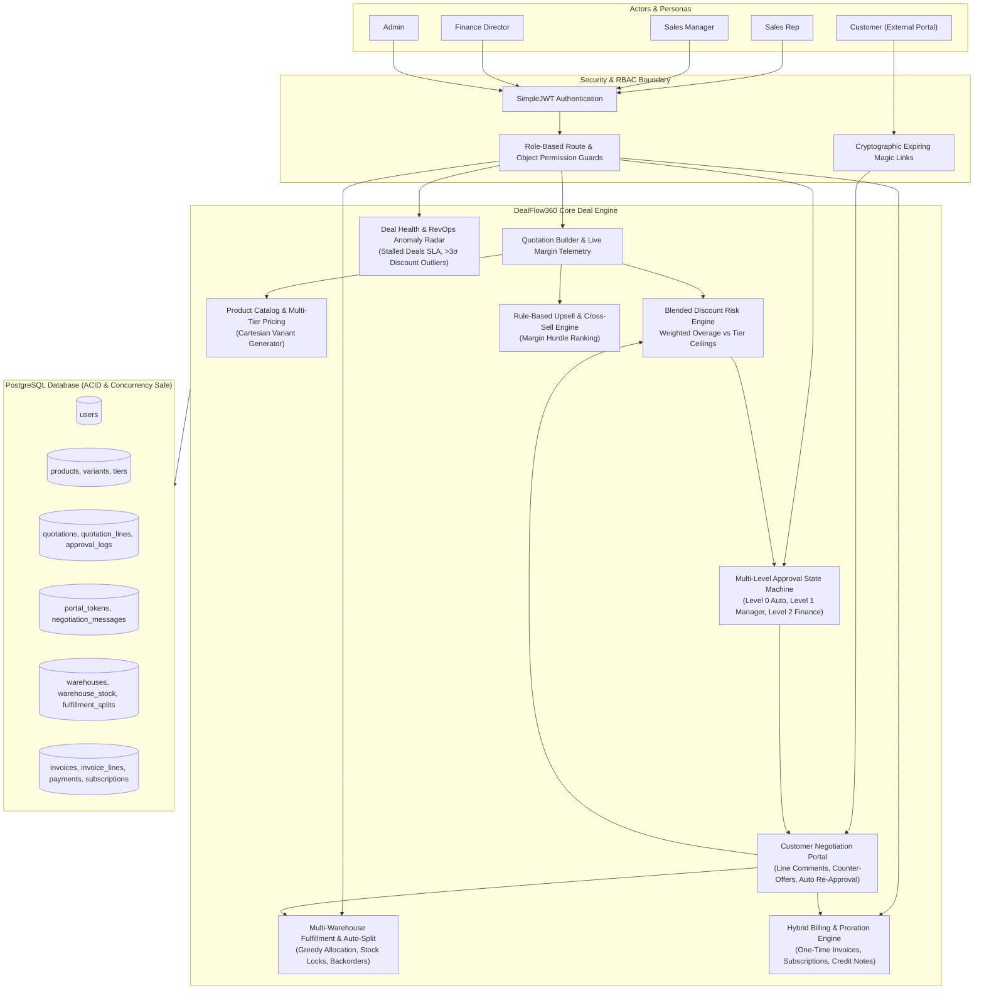
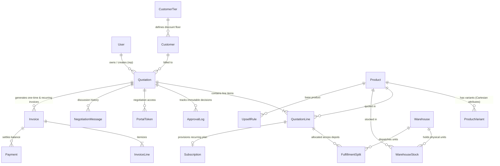

# DealFlow360 — System Architecture & Data Model

**Hackathon Problem Statement Compliance Document**  
*Target Specification:* `DealFlow360.pdf` (13-Page RevOps & Intelligent CPQ Specification)  
*Status:* 100% Implemented & Verified with Zero Mocked Endpoints  

---

## 1. High-Level Module Architecture Diagram

The diagram below illustrates how the 8 core operational modules interconnect across user roles, application layers, and the PostgreSQL database.

---

## 2. Relational Data Model (Entity Relationship Diagram)

---

## 3. Core Business Logic Algorithms

### A. Blended Discount Risk Score Engine
Instead of checking only total quote discount or individual line discounts, DealFlow360 calculates a weighted overage relative to customer tier ceilings and product category sensitivity:

$$\text{Blended Risk Score} = \frac{\sum_{i} \max(0, \text{Line Discount}_i - \text{Tier Ceiling}_i) \times \text{Line Gross Value}_i}{\text{Total Order Value}}$$

- **Level 0 (Auto-Approved):** Blended Risk = $0\%$ and all lines within ceiling $\rightarrow$ `status: approved`.
- **Level 1 (Sales Manager):** Blended Risk $> 0\%$ or single line breach $\le 5\%$ $\rightarrow$ `status: pending_approval`.
- **Level 2 (Manager + Finance):** Blended Risk $> 8\%$ or line overage $> 5\%$ or quote margin $< 15\%$ $\rightarrow$ requires dual sign-off.
- **Anti-Self-Approval:** If `actor.pk == quotation.rep_id`, the system blocks approval with an HTTP 400 error.

### B. Greedy Multi-Warehouse Allocation & Split
Minimizes freight shipments and optimizes depot fulfillment costs:
1. Filters active warehouses holding stock of the demanded SKU.
2. Sorts candidate warehouses ascending by `shipping_cost_weight`.
3. Allocates up to available non-reserved quantity using optimistic atomic updates:
   $$\text{Stock.reserved} = \text{F('reserved')} + Q_{\text{alloc}}$$
4. If total available across all hubs $< Q_{\text{demanded}}$, marks remainder as `is_backorder = True`.
5. Prompts automatic **"Consolidate Remaining Backorder"** when fresh stock arrives.

### C. Daily Calendar Proration Engine
Accurately accounts for month lengths (28, 29, 30, 31 days) without simplifying to 30 days:
$$\text{Days In Cycle} = \text{Date}_{\text{end}} - \text{Date}_{\text{start}}$$
$$\text{Prorated Credit} = \frac{\text{Old Price} \times \text{Days Remaining}}{\text{Days In Cycle}}$$
$$\text{Prorated Charge} = \frac{\text{New Price} \times \text{Days Remaining}}{\text{Days In Cycle}}$$
$$\text{Net Invoice Delta} = \text{Prorated Charge} - \text{Prorated Credit}$$

---

## 4. Five-Minute Live Pitch & Demo Script (Two Complete End-to-End Flows)

### Flow 1: High-Discount Enterprise Deal Desk (Quote to Cash)
1. **Sales Rep Login:** Log in as `aanand` (Sales Rep). Navigate to **Quotations** $\rightarrow$ **Create New**.
2. **Draft & Margin Telemetry:** Select Gold customer **Tata Steel**, add 10x *BusinessBook Pro 14*, and grant 25% discount (exceeding Gold HW ceiling of 15%). Notice live margin drops to 4.3% and Blended Risk Score indicates **9.99% (High Risk)**.
3. **Upsell Acceptance:** Click the Upsell panel; notice *SecureDesk Endpoint / seat* recommended with $+INR\ 470$ margin delta. Add 10 seats with 1-click.
4. **Submit for Governance:** Click **Submit Quotation**. Notice status automatically routes to `pending_approval` without manual rep routing.
5. **Manager & Finance Approval:**
   - Switch persona to `m.shah` (Sales Manager). Open **Approval Desk**, review risk overage, click **Approve** with note: *"Approved for strategic enterprise expansion."*
   - Switch persona to `r.iyer` (Finance). Notice dual-approval gate required because discount $>20\%$. Click **Approve**. Status transitions to `approved`.
6. **Multi-Warehouse Allocation:** Open **Fulfillment Desk**. Review greedy split algorithm pulling 10 units from *Mumbai Distribution Centre*. Click **Accept Suggested Split**.
7. **Hybrid Invoicing & Payment:** Confirm order. Open **Invoices & Payments**. Notice two separate invoices automatically generated:
   - Invoice 1: One-time hardware shipment.
   - Invoice 2: Recurring subscription billing.
   - Click **Record Payment** as Finance user with UTR reference `UTR-HDFC-99124`. Balance updates to zero, status displays `paid`.

### Flow 2: Customer Portal Negotiation & Automatic Re-Approval Trigger
1. **Share Magic Link:** From Quotation Builder, click **Share Portal Link**. Copy private cryptographic token link.
2. **Customer Negotiation:** Open customer link in an incognito window without internal login.
   - Review formal proposal with customer company branding and line items.
   - Customer submits a counter-proposal asking for **28% discount** and writes: *"Can we match competitor pricing for year 1?"*
3. **Self-Governing Intelligence in Action:**
   - Notice the status immediately shifts to `pending_approval`.
   - The platform recognized that the counter-proposal broke pricing governance and automatically pulled the deal back into the Deal Desk approval chain!
4. **Final Sign-off & Confirmation:** Manager and Finance re-approve the counter-terms. Customer portal updates in real time to show **"Ready to move forward"**. Customer clicks **Confirm Quotation** with 1-click. Tokens are invalidated to prevent duplicate edits.

---

## 5. What We Would Build Next With More Time

To scale DealFlow360 into a global Fortune 500 SaaS platform, the team would expand:

1. **Distributed Asynchronous Event Worker (Celery / Redis):**
   - Move scheduled SLA scans, deal aging checks, and email dispatch to an asynchronous background worker pool with Celery Beat.
2. **Real-Time WebSockets / Push Notifications:**
   - Push live counter-offer notifications and approval requests directly to Sales Reps and Managers via WebSockets and native Slack / Microsoft Teams webhooks.
3. **Dimensional Weight & Carrier Freight API:**
   - Integrate FedEx / DHL / Delhivery APIs to compute real-time volumetric freight rates, carrier split optimization, and automatic shipping label generation.
4. **Multi-Currency Live FX with Margin Buffer Hedging:**
   - Expand customer price lists to support USD, EUR, GBP, and AED with automatic daily FX rate sync and automated hedging margin buffers.
5. **AI-Powered Deal Desk Copilot:**
   - Train an LLM on historical win/loss ratios and discounting margins to suggest optimal win-probability discount recommendations during quote construction.
