# DealFlow360 — Master Engineering & Implementation Plan (AI/Codex Handoff)

> **Document Purpose**: This file provides immediate, complete, zero-loss operational handoff for OpenAI Codex, Antigravity, or any AI/human engineer continuing work on DealFlow360. Minimal token overhead, maximum technical precision.

---

## 1. Project Context & Environment Essentials

- **Repository Root**: `d:\Projects\DealFlow360\DealFlow360` *(IMPORTANT: All git commands, backend commands, and frontend commands must run within this directory).*
- **Git Identity (MANDATORY)**:
  - Name: `aanandmodi`
  - Email: `aanandmodi09@gmail.com`
- **Remote**: `https://github.com/aanandmodi/DealFlow360.git` on branch `main`
- **Active Servers**:
  - Backend: Django 5 on `http://localhost:8000` (`.\venv\Scripts\python.exe manage.py runserver 0.0.0.0:8000`)
  - Frontend: Vite React 18 on `http://localhost:5173` (`npm run dev`)
- **Key Credentials (Seeded)**:
  - Sales Rep: `elena.vance` / `demo123`
  - Sales Manager: `m.shah` / `demo123`
  - Finance Officer: `r.iyer` / `demo123`
  - System Admin: `admin` / `admin123`
  - Customer Portal Token URL: `http://localhost:5173/portal/quotations/27dd27b7-13df-4864-b8f1-6db82ee9bef0` (or `.../portal/quotations/Q-1042`)

---

## 2. Current Architecture & System State

```mermaid
graph TB
    subgraph Frontend ["React 18 + Vite (localhost:5173)"]
        Nav["AppShell + 1-Click Role Switcher"]
        D_Rep["Sales Rep Dashboard (Quota $500K, My Deals)"]
        D_Mgr["Manager Dashboard (Deal Desk, Approvals Queue)"]
        D_Fin["Finance Dashboard (ARR $1.4M, Margin Floor 25%)"]
        D_Adm["Admin Dashboard (Platform 360 Overview)"]
        CPQ["CPQ Quotation Builder + Smart Upsell Panel"]
        Kanban["5-Stage Pipeline Kanban (Draft->Confirmed)"]
        Appr["Discount Approvals Desk + Memorandum Log"]
        Fulfill["Warehouse Multi-Split Inventory Screen"]
        Bill["Hybrid Billing (CapEx vs OpEx) + Invoices"]
        Health["Deal Health Radar (Stalled Deals, Anomalies)"]
        Portal["Customer Negotiation Portal (Magic Link)"]
        P_Config["Config Screen (/config) -> PLACEHOLDER"]
        P_Reports["Reports Screen (/reports) -> PLACEHOLDER"]
    end

    subgraph Backend ["Django 5 REST Framework (localhost:8000)"]
        Core_App["core: User, Roles, Auth, JWT"]
        Quotations_App["quotations: Customer, Product, PriceList, DiscountTier, Quotation, Lines, Logs, RiskScore Engine"]
        Fulfillment_App["fulfillment: Warehouse, StockLevel, FulfillmentSplit, Greedy Split Allocator"]
        Billing_App["billing: SubscriptionPlan, Invoice, Payment, UpsellRule, Proration Engine"]
        Portal_App["portal: NegotiationMessage, PortalToken, Magic-link verification"]
    end

    subgraph Database ["Persistence Layer"]
        DB_Current["SQLite: db.sqlite3 (Migrated & Seeded)"]
        DB_Target["PostgreSQL 15: dealflow360_db on Port 5432 (Docker)"]
    end

    Frontend --> Backend
    Backend --> Database
```



---

## 3. Comprehensive Audit: Built vs. Remaining ([DealFlow360.pdf](file:///d:/Projects/DealFlow360/DealFlow360/reference/DealFlow360.pdf))

### ✅ Fully Built & Verified Live (100% Operational):
1. **Multi-Tier Discount Governance & Risk Engine**:
   - Per-line ceiling evaluations factoring Customer Tier $\times$ Product Category.
   - Blended risk score calculation formula balancing dollar-weighted overage and maximum single-line breach:
     $$\text{Blended Score} = \frac{\left(\frac{\sum \text{Overage} \times \text{Line Total}}{\text{Order Value}} \times 100\right) + \text{Worst Line Overage}}{2}$$
   - Automatic routing: Score $0 \to$ auto-approved; $\le 10\% \to$ Sales Manager; $> 10\% \to$ Sales Manager + Finance.
2. **CPQ Quotation Builder (`/quotations/new`, `/quotations/:id`)**:
   - Product catalog picker, quantity adjustments, line discounts, real-time margin percentage indicators, live subtotal/tax/discount/total calculations.
3. **Smart Deal Maximizer Upsell Panel (`<UpsellPanel>`)**:
   - Ranked suggestions based on rules, margin delta display (e.g. +$227.50), one-click addition to cart with live price injection.
4. **Multi-Warehouse Allocation & Auto-Split (`/fulfillment`)**:
   - Greedy allocation minimizing shipments and freight costs; backorder identification and consolidation flags.
5. **Hybrid Billing & Daily Proration Engine (`/subscriptions`, `/invoices`)**:
   - Separation of One-Time CapEx (hardware/services) and Recurring OpEx (SaaS subscriptions).
   - Daily proration calculation on mid-cycle changes: $(\Delta \text{Price} / 30) \times \text{Days Remaining}$.
6. **Customer-Facing Negotiation Portal (`/portal/quotations/:token`)**:
   - Tokenized magic-link quotation inspection, threaded comments on line items, counter-offer discount slider, one-click digital acceptance.
   - Counter-offers automatically re-evaluate the risk score and re-route into the approval queue if policy thresholds are breached.
7. **Deal Health & Anomaly Radar (`/deal-health`)**:
   - Surfaces deals stalled $>14$ days (`Q-1031`), discount anomalies exceeding rep averages, and warehouse delivery slippage forecasts.
8. **Role-Based Access Control (RBAC) & Persona Dashboards**:
   - Tailored dashboards for Sales Rep, Sales Manager, Finance, and Admin.
   - 1-Click live Persona Switcher in the top navigation header bar.
   - Route guards (`RoleRoute`) blocking unauthorized roles.

### 🟡 What is Left to Reach Production SaaS Perfection:
1. **Database Migration to PostgreSQL 15**:
   - Boot Docker PostgreSQL container on port `5432` (`dealflow360_db`), connect Django settings, apply migrations, seed realistic data, and verify.
2. **Zero-Leak API Security Hardening & Anti-IDOR**:
   - Eliminate unauthenticated global dumping in `portal_quotations_list`.
   - Enforce DRF permission classes (`IsSalesManagerOrAdmin`, `IsFinanceOrAdmin`, `IsQuotationOwnerOrManager`) on backend endpoints so reps cannot approve their own deals or access other reps' quotes.
   - Add DRF rate limiting (`AnonRateThrottle`, `UserRateThrottle`).
3. **Dedicated Interactive Configuration Screen (`/config`)**:
   - Replace the placeholder on `/config` with a tabbed management console for Products & Variants, Price Lists, Customer Tiers & Ceilings, Warehouses & Stock, Subscription Plans, and Upsell Rules.
4. **Dedicated Executive Analytics Screen (`/reports`)**:
   - Replace the placeholder on `/reports` with date-range filtered reporting (Today, Week, Month, Custom), Sales Rep filter, Category filter, and approval conversion rates.
5. **PDF & CSV Export Engine**:
   - Add printable branded Quotation PDF download in the Quotation Builder.
   - Add CSV / Excel export on Quotations and Reports.
6. **Concurrency & State Machine Locking**:
   - Pessimistic locking (`select_for_update`) during warehouse split acceptance to prevent inventory race conditions.

---

## 4. Step-by-Step Execution Plan for Codex

### Step 1: PostgreSQL 15 Migration & Connection
1. **Start Docker Desktop**:
   - Command: `Start-Process "C:\Program Files\Docker\Docker\Docker Desktop.exe"`
   - Wait for Docker engine to initialize: `docker info`
2. **Launch Database Container**:
   - Run in repo root: `docker-compose up -d db`
   - Verify running on port 5432: `docker ps`
3. **Configure Environment in Backend**:
   - In `backend/dealflow360/settings.py` and `.env`:
     ```env
     POSTGRES_DB=dealflow360
     POSTGRES_USER=dealflow360
     POSTGRES_PASSWORD=dealflow360pass
     POSTGRES_HOST=localhost
     POSTGRES_PORT=5432
     USE_SQLITE=0
     ```
4. **Run Migrations & Seed**:
   - `.\venv\Scripts\python.exe manage.py migrate`
   - `.\venv\Scripts\python.exe manage.py seed_data`
   - Verify connection: `.\venv\Scripts\python.exe manage.py check --database default`

---

### Step 2: Zero-Leak Enterprise Security & RBAC Hardening
1. **Create Custom DRF Permission Classes in `backend/core/permissions.py`**:
   ```python
   from rest_framework import permissions

   class IsSalesManagerOrAdmin(permissions.BasePermission):
       def has_permission(self, request, view):
           return bool(request.user and request.user.is_authenticated and request.user.role in ('sales_manager', 'admin'))

   class IsFinanceOrAdmin(permissions.BasePermission):
       def has_permission(self, request, view):
           return bool(request.user and request.user.is_authenticated and request.user.role in ('finance', 'admin'))

   class IsQuotationOwnerOrManager(permissions.BasePermission):
       def has_object_permission(self, request, view, obj):
           if request.user.role in ('sales_manager', 'finance', 'admin'):
               return True
           return getattr(obj, 'rep', None) == request.user or getattr(obj, 'sales_rep', None) == request.user
   ```
2. **Harden Approval & Action Endpoints in `backend/quotations/views.py`**:
   - Apply `[IsSalesManagerOrAdmin | IsFinanceOrAdmin]` to `quotation_approve`, `quotation_reject`, `quotation_return`, `quotation_confirm`.
   - Apply `IsQuotationOwnerOrManager` to `quotation_detail`, `quotation_lines`, and `quotation_submit`.
3. **Lock Customer Portal Data Scraping in `backend/portal/views.py`**:
   - In `portal_quotations_list`: Disallow unauthenticated global dumping. Require a valid session token or authenticated customer user.
   - In `portal_quotation_view`: Remove insecure ID-guessing fallbacks (`token.isdigit()`) in production mode; only resolve via valid cryptographic `portal_token` or `PortalToken` session.
4. **Enable Rate Limiting in `backend/dealflow360/settings.py`**:
   - Set `DEFAULT_THROTTLE_CLASSES` and `DEFAULT_THROTTLE_RATES` (`anon: '60/minute'`, `user: '300/minute'`).

---

### Step 3: Native System Configuration Screen (`/config`)
1. **Create `frontend/src/features/config/ConfigPage.tsx`**:
   - Tab 1: **Products & Variants** — Table displaying SKU, Name, Category, Base Price, Tax %, and attribute variants (RAM, Storage).
   - Tab 2: **Discount Ceilings** — Interactive grid showing discount ceilings per Customer Tier (Bronze, Silver, Gold) and Category (Hardware, Services, Software, Subscriptions).
   - Tab 3: **Warehouses & Inventory** — Display warehouse locations, freight cost weights, and live stock levels.
   - Tab 4: **Subscription Plans** — Display recurring plans (Monthly, Quarterly, Yearly) with pricing.
   - Tab 5: **Upsell Rules** — View cross-sell pairings and margin thresholds.
2. **Mount in `frontend/src/App.tsx`**:
   - Replace `PlaceholderPage` at `/config` with `<ConfigPage />` protected by `RoleRoute allowedRoles={['sales_manager', 'admin']}`.

---

### Step 4: Executive Analytics & Sales Performance Screen (`/reports`)
1. **Create `frontend/src/features/reports/ReportsPage.tsx`**:
   - Header with Filter Bar: Period (`Today`, `This Week`, `This Month`, `Custom Range`), Sales Rep filter (`All`, `Marcus Ross`, `Sarah Lin`, etc.), Status filter.
   - KPI Summary Cards: Total Bookings, Win Rate %, Average Deal Margin %, Discount Leakage.
   - Visual Charts: Monthly pipeline trend, Deals by stage, Discount distribution by rep.
   - Quick Export Buttons: "Export to CSV" and "Export PDF Summary".
2. **Mount in `frontend/src/App.tsx`**:
   - Replace `PlaceholderPage` at `/reports` with `<ReportsPage />`.

---

### Step 5: PDF & CSV Export Engine
1. **Backend Export Service in `backend/quotations/views_export.py`**:
   - Using Python's `reportlab` (already in `requirements.txt`) or clean HTML-to-PDF to generate official Quotation PDFs with company logo, quote number, customer billing details, line items, and totals.
   - CSV export for quotations pipeline: exports quote number, customer, rep, total, margin %, status, created date.
2. **Frontend UI Buttons**:
   - Add "Download PDF" button in `QuotationBuilderPage.tsx` header.
   - Add "Export CSV" button in `QuotationListPage.tsx` and `ReportsPage.tsx`.

---

### Step 6: Concurrency & State Machine Hardening
1. **Pessimistic Locking in `backend/fulfillment/views.py`**:
   - In `accept_split`:
     ```python
     with transaction.atomic():
         stock = StockLevel.objects.select_for_update().get(warehouse=wh, product=prod)
         if stock.available < qty:
             raise ValidationError("Insufficient inventory")
         stock.reserved += qty
         stock.save()
     ```
2. **State Machine Transition Guarding in `backend/quotations/services/risk_score.py`**:
   - Prevent invalid transitions (e.g. attempting to approve a draft or confirm an unapproved quote).

---

## 5. Verification & Testing Checklist

1. **Build Verification**:
   - Run `npm run build` in `frontend/` $\to$ must compile with 0 errors.
2. **Database Verification**:
   - `python manage.py check --database default` $\to$ must verify PostgreSQL connection.
   - `python manage.py migrate` $\to$ all 22 migrations applied on PostgreSQL.
3. **Security Testing**:
   - As Sales Rep (`elena.vance`), attempt to POST `/api/quotations/1/approve/` $\to$ expect `403 Forbidden`.
   - As Manager (`m.shah`), POST `/api/quotations/1/approve/` $\to$ expect `200 OK`.
   - Without token, attempt to GET `/api/portal/quotations/` $\to$ expect `401/403` or filtered response.
4. **Browser Subagent Flow Verification**:
   - Verify `/config` renders tabbed catalog.
   - Verify `/reports` renders filtered KPIs and downloads CSV.
   - Verify "Download PDF" in builder generates a valid document.
   - Verify Customer Portal negotiation counter-offer and re-approval flow.

---

## 6. Git Identity & Commit Protocol

When pushing changes to GitHub:
```powershell
git config user.name "aanandmodi"
git config user.email "aanandmodi09@gmail.com"
git add -A
git commit -m "feat(saas): enterprise hardening, postgresql migration, and complete config/reporting modules"
git push origin main
```
