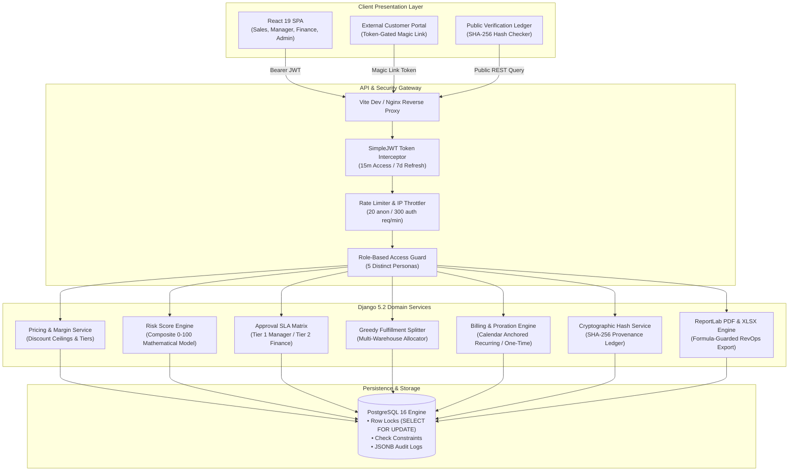
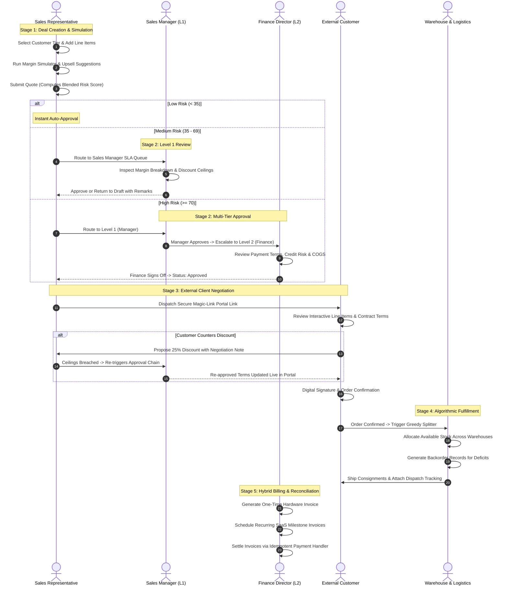
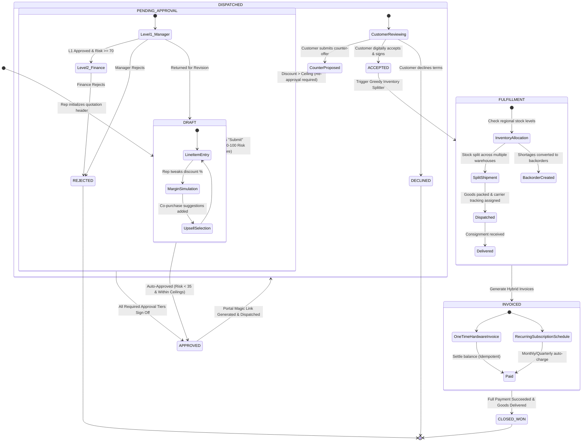
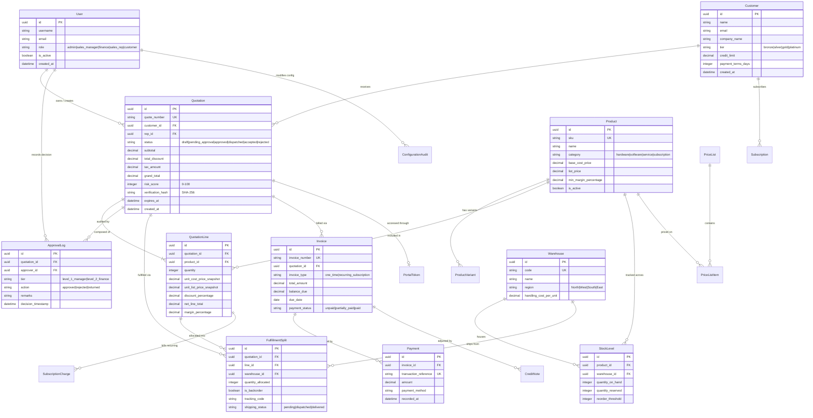

# DealFlow360

<div align="center">


**Autonomous AI-Assisted Quote-to-Cash (Q2C) & Dynamic Revenue Operations Engine**

[](https://docs.djangoproject.com/)
[](https://react.dev/)
[](https://www.typescriptlang.org/)
[](https://www.postgresql.org/)
[](https://vitejs.dev/)
[](https://tailwindcss.com/)
[](https://www.django-rest-framework.org/)
[](https://django-rest-framework-simplejwt.readthedocs.io/)
[](backend/core/tests.py)
[](backend/persona_5_dry_run_test.py)
[](LICENSE)

*Eliminating RevOps friction, margin leakage, and fulfillment bottlenecks across enterprise B2B sales cycles.*

</div>

---

## Table of Contents
1. [Abstract & Executive Summary](#abstract--executive-summary)
2. [What Is It? (The Enterprise Problem Space)](#what-is-it-the-enterprise-problem-space)
3. [Our Solution: The Self-Governing Deal Engine](#our-solution-the-self-governing-deal-engine)
4. [Tech Stack & Deep Architectural Justification](#tech-stack--deep-architectural-justification)
5. [System Architecture & Topology](#system-architecture--topology)
6. [End-to-End User Flow (5 Distinct Personas)](#end-to-end-user-flow-5-distinct-personas)
7. [Quotation-to-Cash Data Flow Lifecycle](#quotation-to-cash-data-flow-lifecycle)
8. [Database Architecture & Entity-Relationship Diagram](#database-architecture--entity-relationship-diagram)
9. [Detailed Module Breakdown](#detailed-module-breakdown)
10. [Folder & Directory Structure](#folder--directory-structure)
11. [Installation & Local Setup Guide](#installation--local-setup-guide)
12. [Role-Based Access Control & Demo Credentials](#role-based-access-control--demo-credentials)
13. [Testing & Quality Assurance Verification](#testing--quality-assurance-verification)
14. [Future Planning & Enterprise Roadmap](#future-planning--enterprise-roadmap)
15. [Contributing Guidelines](#contributing-guidelines)
16. [Code of Conduct](#code-of-conduct)
17. [License & Acknowledgments](#license--acknowledgments)

---

## Abstract & Executive Summary

In high-velocity enterprise B2B commerce, the traditional **Quote-to-Cash (Q2C)** pipeline is chronically fractured. Commercial sales organizations lose an estimated **3% to 7% of gross margin annually** due to stealth discounting, uncoordinated warehouse logistics, multi-tiered approval deadlocks, and disconnected subscription proration models. 

**DealFlow360** is an autonomous, self-governing revenue operations platform designed to orchestrate complex B2B commercial transactions with mathematical precision. Engineered on a high-concurrency **Django 5.2 + PostgreSQL 16** backend and an ultra-responsive **React 19 + TypeScript** frontend, DealFlow360 continuously harmonizes catalog pricing, customer credit tiers, multi-node warehouse allocations, and automated SLA-governed approvals into a single source of commercial truth.

By replacing static spreadsheets and disconnected CRM silos with **real-time margin simulation**, a **deterministic 0–100 blended risk engine**, **greedy multi-warehouse split optimization**, and **cryptographic quote verification**, DealFlow360 accelerates deal velocity while safeguarding enterprise margins.

---

## What Is It? (The Enterprise Problem Space)

Modern enterprise RevOps teams grapple with five structural bottlenecks:

```
┌───────────────────────┐     ┌───────────────────────┐     ┌───────────────────────┐
│  Stealth Discounting  │     │  Approval Latency &   │     │ Fulfillment Blindness │
│   & Margin Erosion    │ ──> │    Deal Stagnation    │ ──> │   & Stock Shortages   │
│ (Unmonitored margins) │     │ (72h+ bottleneck)     │     │ (Split-shipment costs)│
└───────────────────────┘     └───────────────────────┘     └───────────────────────┘
                                         │
                                         ▼
┌───────────────────────────────────────────────────────────────────────────────────┐
│     Hybrid Billing Discordance (One-Time Hardware + Recurring SaaS Subscriptions)  │
│        + Post-Issuance Document Tampering & Commercial Audit Invalidation         │
└───────────────────────────────────────────────────────────────────────────────────┘
```

1. **Margin Erosion & Rogue Discounting**: Sales representatives frequently apply steep percentage discounts to hit quarterly quotas without visibility into net contribution margins, line-item COGS, or customer payment risk profiles.
2. **Approval Process Bottlenecks**: High-stakes deals stall in email threads and generic ticketing queues. Sales managers and finance directors lack automated contextual decision support, resulting in days of deal stagnation.
3. **Fulfillment Blindness**: Deals are approved and signed without real-time inventory visibility across distributed warehouses. This triggers emergency split shipments, backorder expediting penalties, and customer churn.
4. **Hybrid Billing Discordance**: Enterprise contracts increasingly bundle physical capital equipment, professional services, and recurring SaaS subscriptions. Reconciling one-time invoices with monthly/quarterly prorated billing cycles creates accounting friction and revenue recognition errors.
5. **Contract Tampering & Lack of Provenance**: Traditional PDF quotes exchanged over email can be altered, disputed, or negotiated out-of-band without immutable cryptographic tracking.

---

## Our Solution: The Self-Governing Deal Engine

DealFlow360 bridges the gap between sales velocity and financial discipline through six foundational pillars:

```
                                  DEALFLOW360
                             Autonomous RevOps Core
                                       │
     ┌──────────────────┬──────────────┴──────────────┬──────────────────┐
     ▼                  ▼                             ▼                  ▼
┌──────────────┐ ┌──────────────┐             ┌──────────────┐ ┌──────────────┐
│  Blended     │ │  Live Upsell │             │  Greedy Multi│ │  Hybrid      │
│  Margin &    │ │  & Margin    │             │  Warehouse   │ │  Invoicing & │
│  Risk Engine │ │  Simulator   │             │  Splitter    │ │  Proration   │
└──────────────┘ └──────────────┘             └──────────────┘ └──────────────┘
        │                                                            │
        └──────────────────────────────┬─────────────────────────────┘
                                       ▼
                     ┌───────────────────────────────────┐
                     │ External Magic-Link Portal &      │
                     │ Cryptographic Verification Ledger │
                     └───────────────────────────────────┘
```

* **Deterministic Blended Risk Engine**: Evaluates discount breaches against customer tier ceilings, margin deviations, and credit exposure to generate an instantaneous 0–100 composite risk score. Automatically routes low-risk deals for auto-approval, medium-risk to Sales Managers (Tier 1), and high-risk to Finance Directors (Tier 2).
* **Live Margin Simulator & Upsell Recommender**: Real-time product affinity recommendations suggest high-margin accessories and services during quotation drafting. Interactive sliders let reps explore "what-if" margin scenarios before submission.
* **Greedy Multi-Warehouse Inventory Split**: Algorithmic stock allocation partitions line items across regional warehouses, prioritizing full single-node fulfillment to minimize freight costs and automatically generating backorders for remaining quantities.
* **Hybrid Billing & Calendar-Anchored Proration**: Seamlessly combines one-time hardware lines with recurring software subscriptions. Proration math respects calendar boundaries (including February leap years and 31-day months) with idempotent credit note generation.
* **Deal Health Anomaly Radar**: Statistical revenue intelligence scans pipeline velocity, identifying stagnating deals, negative margin outliers, and discount creep, pairing them with automated remediation triggers.
* **Token-Gated Customer Portal & SHA-256 Provenance**: Magic-link customer negotiation portal allows clients to review line items, counter-propose discounts within policy, and digitally accept quotes. Cryptographic hash-chaining guarantees document authenticity.

---

## Tech Stack & Deep Architectural Justification

DealFlow360 is built upon an intentional, enterprise-proven technology stack selected for correctness, scalability, and developer ergonomics:

```
┌───────────────────────────────────────────────────────────────────────────────────┐
│                               FRONTEND APPLICATION                                │
│       React 19.0 · TypeScript 5.8 · Vite 8.0 · Tailwind CSS v4 · Recharts         │
│     TanStack React Query v5 · Lucide Icons · Unified Custom CSS Design Tokens     │
└───────────────────────────────────────────────────────────────────────────────────┘
                                         │  HTTPS / REST / JWT Bearer
                                         ▼
┌───────────────────────────────────────────────────────────────────────────────────┐
│                                BACKEND SERVICES                                   │
│    Django 5.2 (LTS) · Django REST Framework 3.18 · SimpleJWT (OAuth2/Bearer)      │
│   ReportLab 4.5 (Cryptographic PDF) · OpenPyXL (Formula-Guarded Excel Export)     │
└───────────────────────────────────────────────────────────────────────────────────┘
                                         │  ACID Transactions / Row Locks
                                         ▼
┌───────────────────────────────────────────────────────────────────────────────────┐
│                           PERSISTENCE & INFRASTRUCTURE                            │
│           PostgreSQL 16 (Relational Constraints, JSONB, SELECT FOR UPDATE)        │
│                       Docker & Docker Compose Containerization                    │
└───────────────────────────────────────────────────────────────────────────────────┘
```

### Why We Chose Each Technology

| Layer | Technology | Architectural Justification | Alternatives Considered |
|---|---|---|---|
| **Backend Framework** | **Django 5.2 LTS** | Offers battle-tested ORM with strict relational integrity, native transaction management (`atomic`, `select_for_update`), and declarative migrations. Its built-in security features protect against CSRF, SQL injection, and clickjacking out of the box. | *FastAPI*: Lacks mature, battle-tested ORM migration ecosystem and native administrative tooling. *Express/Node*: Requires stitching together ad-hoc ORMs that lack built-in ACID safety for financial records. |
| **API Architecture** | **Django REST Framework (DRF)** | Provides declarative serializers with bidirectional validation, pluggable authentication/permission classes, and robust filtering and pagination. | *GraphQL*: High query complexity, challenging caching mechanics, and unnecessary overhead for structured financial entity operations. |
| **Database** | **PostgreSQL 16** | Strict ACID compliance, check constraints (`CheckConstraint`), unique constraints, JSONB column flexibility for dynamic approval chains, and robust row-level concurrency locking (`SELECT FOR UPDATE`). | *MySQL*: Inferior JSON handling and concurrency ergonomics. *MongoDB*: Inadequate transactional guarantees for multi-line financial ledger updates. |
| **Authentication** | **django-rest-framework-simplejwt** | Stateless Bearer token architecture with 15-minute access tokens and 7-day rotating refresh tokens. Allows decoupled frontend client consumption with zero session lock-in. | *Session Auth*: Difficult to scale across distributed client tiers and mobile endpoints without sticky sessions. |
| **Document Generation** | **ReportLab & OpenPyXL** | Native, server-side PDF compilation producing deterministic, high-fidelity commercial quotation sheets. OpenPyXL provides formula-injection-protected Excel exports. | *Puppeteer / Chromium*: Unnecessary resource footprint (~300MB RAM per worker) and vulnerability to headless browser crashes. |
| **Frontend Core** | **React 19 + TypeScript 5.8** | Component-driven UI with strong compile-time type guarantees across all DTO interfaces, strict null checks, and modern concurrent rendering primitives. | *Vue / Angular*: Less ubiquitous typing ecosystem for high-density enterprise dashboard components. |
| **Build & Tooling** | **Vite 8.0** | Sub-second Hot Module Replacement (HMR) powered by native ES modules, producing optimized production bundles in under 1.5 seconds. | *Webpack / CRA*: Slow incremental rebuilds, bloated configuration maintenance. |
| **State & Data Fetching** | **TanStack React Query v5** | Declarative asynchronous cache management, automatic background refetching, optimistic mutation updates, and automatic garbage collection. | *Redux*: Excessive boilerplate for managing server-synchronized state. |
| **Styling Architecture** | **Tailwind CSS v4 + Design Tokens** | Utility-first styling combined with centralized CSS variables (`--color-surface-card`, `--color-brand-primary`) to maintain a unified enterprise design language across dark/light modes. | *CSS Modules*: Fragmented styling rules lacking global token ergonomics. |
| **Visual Analytics** | **Recharts** | High-performance SVG charting library built specifically for React, delivering fluid animations for pipeline waterfalls, margin trends, and risk radars. | *Chart.js*: Requires imperative canvas wrapping and lacks declarative React component semantics. |

---

## System Architecture & Topology

The following diagram illustrates the topological structure of DealFlow360, demonstrating the interaction between the presentation layer, the API gateway, the transactional domain service layer, and PostgreSQL persistence:



---

## End-to-End User Flow (5 Distinct Personas)

DealFlow360 implements strict separation of duties across 5 operational personas:



---

## Quotation-to-Cash Data Flow Lifecycle

The following state machine details every state transition, prerequisite condition, and validation boundary in the quotation lifecycle:



---

## Database Architecture & Entity-Relationship Diagram

DealFlow360 utilizes a normalized relational architecture inside **PostgreSQL 16**, ensuring zero data duplication, strict referential integrity, and atomic financial updates:



---

## Detailed Module Breakdown

### 1. Deterministic Blended Risk Engine
The risk engine eliminates arbitrary discount approvals by calculating an objective, repeatable risk score $R \in [0, 100]$:

$$R = w_d \cdot D_{\text{breach}} + w_m \cdot M_{\text{dev}} + w_c \cdot C_{\text{tier}} + w_s \cdot S_{\text{size}}$$

* **Discount Breach ($D_{\text{breach}}$)**: Measures the magnitude by which any line item exceeds the customer's tier discount ceiling.
* **Margin Deviation ($M_{\text{dev}}$)**: Evaluates the delta between the quote's blended gross margin and the enterprise floor margin (default: 25%).
* **Customer Tier Risk ($C_{\text{tier}}$)**: Adjusts risk according to customer historical reliability (Bronze: 1.0, Silver: 0.7, Gold: 0.4, Platinum: 0.2).
* **Order Size Exposure ($S_{\text{size}}$)**: Logarithmically scales capital exposure for deals exceeding ₹1,000,000.

| Risk Score | Tier Classification | Routing Action |
|---|---|---|
| **0 – 34** | **Low Risk** | Instant Auto-Approval; Bypass manual manager review |
| **35 – 69** | **Medium Risk** | Tier 1: Escalates to Sales Manager SLA Queue |
| **70 – 100** | **High Risk** | Tier 2: Requires sequential Manager + Finance Director Approval |

### 2. Greedy Multi-Warehouse Inventory Splitter
When a quotation with physical hardware is accepted, the fulfillment engine minimizes freight costs and split-shipment fragmentation using a greedy allocation strategy:
1. **Single-Node Preference**: Inspects whether any single regional warehouse can fulfill 100% of line items.
2. **Cost-Weighted Partitioning**: If single-node fulfillment is unavailable, sorts available warehouses by stock density and proximity handling cost.
3. **Atomic Stock Reservation**: Employs PostgreSQL `SELECT ... FOR UPDATE` row locks to decrement `quantity_on_hand` and increment `quantity_reserved`, eliminating race conditions and double-commit hazards.
4. **Backorder Segregation**: Unfulfillable quantities are immediately segregated into dedicated backorder records with supplier replenishment ETA tracking.

### 3. Hybrid Billing & Calendar-Anchored Proration
Enterprise contracts often bundle physical hardware with monthly or annual software subscriptions:
* **Separation of Invoicing**: Automatically splits confirmed quotations into one-time hardware tax invoices and recurring SaaS payment schedules.
* **Calendar-Anchored Proration**: Calculates exact mid-cycle addition and cancellation adjustments. The engine properly handles month-end boundaries (e.g., January 31 renewing on February 28/29).
* **Credit Note Issuance**: Subscription cancellations calculate unused days and generate a formal, ledger-reconciled credit note.

### 4. Deal Health Anomaly Radar & Remediation
The Deal Health dashboard monitors pipeline health in real time:
* **Velocity Decay Warning**: Highlights quotes that have lingered in `IN_REVIEW` beyond the 48-hour SLA deadline.
* **Margin Outlier Detection**: Identifies deals whose contribution margin falls below category break-even.
* **Automated Remediation Actions**: Privileged administrators can trigger single-click remediation workflows (e.g., auto-escalate stagnant deals, re-apply standard tier discounts).

### 5. Cryptographic Provenance Ledger
Every quotation approved in DealFlow360 generates an immutable SHA-256 digital fingerprint calculated across:
```python
quote_payload = f"{quote_number}:{customer_id}:{grand_total}:{created_at.isoformat()}:{line_items_hash}"
verification_hash = hashlib.sha256(quote_payload.encode('utf-8')).hexdigest()
```
The public verification endpoint (`/verify/:quoteNumber`) allows customers, auditors, and legal teams to independently verify that a commercial quotation has not been modified after approval.

---

## Folder & Directory Structure

DealFlow360 enforces a modular separation of concerns across both backend and frontend codebases:

```
DealFlow360/
├── .env.example                     # Environment template with secure defaults
├── docker-compose.yml               # PostgreSQL 16 local orchestration
├── README.md                        # Master project documentation
│
├── backend/                         # Django 5.2 Enterprise API
│   ├── manage.py                    # Django management runner
│   ├── requirements.txt             # Python production dependencies
│   ├── persona_5_dry_run_test.py    # 5-Persona E2E dry run test harness
│   │
│   ├── dealflow360/                 # Project Configuration
│   │   ├── settings.py              # Environment-driven settings, JWT, CORS, RBAC
│   │   ├── urls.py                  # Master routing table
│   │   ├── wsgi.py                  # Production WSGI server gateway
│   │   └── asgi.py                  # Async ASGI gateway
│   │
│   ├── core/                        # Authentication, Users & Foundation
│   │   ├── models.py                # Custom User model (5 roles), ConfigurationAudit
│   │   ├── views.py                 # Auth endpoints (login, register, me, users)
│   │   ├── permissions.py           # Role-based permission decorators
│   │   ├── verification.py          # Cryptographic SHA-256 quote verification
│   │   └── tests.py                 # Comprehensive 28-scenario test suite
│   │
│   ├── quotations/                  # Pricing & Deal Governance Engine
│   │   ├── models.py                # Quotation, LineItem, Customer, Product, Catalog
│   │   ├── views.py                 # Deal CRUD, submission, pipeline aggregation
│   │   └── services/                # Encapsulated Domain Logic
│   │       ├── pricing.py           # Catalog pricing & discount tier calculators
│   │       ├── risk_score.py        # 0-100 blended risk scoring algorithm
│   │       ├── approval.py          # Sequential multi-tier approval state machine
│   │       └── dispatch.py          # Tokenized portal dispatch service
│   │
│   ├── fulfillment/                 # Logistics & Inventory Engine
│   │   ├── models.py                # Warehouse, StockLevel, FulfillmentSplit
│   │   ├── views.py                 # Split suggestions, override, consolidation
│   │   └── services/
│   │       └── splitter.py          # Greedy multi-warehouse allocation algorithm
│   │
│   ├── billing/                     # Subscriptions, Invoicing & Proration
│   │   ├── models.py                # SubscriptionPlan, Invoice, Payment, CreditNote
│   │   ├── views.py                 # Billing schedule, payment handler, upsell recs
│   │   └── services/
│   │       ├── proration.py         # Calendar-anchored proration calculator
│   │       └── upsell.py            # Co-purchase affinity recommendation engine
│   │
│   └── portal/                      # Customer External Negotiation
│       ├── models.py                # PortalToken, NegotiationMessage
│       └── views.py                 # Magic-link auth, counter-offers, accept/reject
│
└── frontend/                        # React 19 + TypeScript Application
    ├── index.html                   # HTML5 entrypoint & Google Fonts integration
    ├── package.json                 # Node scripts & dependencies
    ├── tsconfig.json                # TypeScript strict configuration
    ├── vite.config.ts               # Vite configuration with API reverse proxy
    │
    └── src/
        ├── App.tsx                  # Top-level routing & role route guards
        ├── main.tsx                 # React DOM mount with QueryClient
        ├── index.css                # Global design tokens, theme variables & animations
        │
        ├── api/                     # Type-Safe HTTP Client Layer
        │   ├── client.ts            # ApiClient with automatic JWT token refresh
        │   ├── auth.ts              # Authentication & user profile endpoints
        │   ├── quotations.ts        # Deal builder & pipeline queries
        │   ├── approvals.ts         # Manager & Finance SLA actions
        │   ├── fulfillment.ts       # Warehouse split & dispatch mutations
        │   └── copilot.ts           # Deal intelligence & scenario queries
        │
        ├── context/
        │   └── AuthContext.tsx      # Global auth state, session storage & role helper
        │
        └── features/                # Domain-Driven UI Feature Modules
            ├── shell/               # AppShell, responsive sidebar, user avatar menu
            ├── dashboard/           # SalesDashboard, KPI cards, Deal Health Radar
            ├── pipeline/            # Kanban PipelinePage & QuotationListPage
            ├── quotation-builder/   # QuotationBuilderPage, LineItemEditor, MarginSim
            ├── approval/            # ApprovalListPage & ApprovalDetailPage
            ├── fulfillment/         # FulfillmentPage (Warehouse allocation visualizer)
            ├── workspace/           # InvoicesPage, InventoryPage, BillingPage
            ├── portal-negotiation/  # Customer-facing magic-link negotiation portal
            ├── verification/        # Public QuotationVerificationPage
            └── reports/             # ReportsPage with PDF, XLSX, and CSV exports
```

---

## Installation & Local Setup Guide

### Prerequisites
* **Python 3.11+**
* **Node.js 20+** and **npm 10+**
* **PostgreSQL 15+** (or Docker Desktop)
* **Git**

---

### Step 1: Clone the Repository & Configure Environment

```bash
# Clone the repository
git clone https://github.com/aanand-1/DealFlow360.git
cd DealFlow360/DealFlow360

# Copy the environment file template
cp .env.example .env
```

Edit `.env` to configure your PostgreSQL credentials and secrets:
```ini
DJANGO_SECRET_KEY=dealflow360-super-secure-dev-secret-key-change-in-prod-xyz
DJANGO_DEBUG=True
POSTGRES_DB=dealflow360
POSTGRES_USER=postgres
POSTGRES_PASSWORD=postgres
POSTGRES_HOST=localhost
POSTGRES_PORT=5432
FRONTEND_URL=http://localhost:5173
DEMO_PASSWORD=DemonstrationPassword123!
```

---

### Step 2: Launch PostgreSQL Database

Using Docker:
```bash
docker compose up -d
```
*Or ensure your local PostgreSQL service is running and create the `dealflow360` database.*

---

### Step 3: Backend Setup & Seed Data

Open a terminal in the `backend/` directory:

```bash
cd backend

# Create virtual environment
python -m venv venv

# Activate virtual environment
# Windows (PowerShell):
.\venv\Scripts\Activate.ps1
# macOS / Linux:
source venv/bin/activate

# Install dependencies
pip install -r requirements.txt

# Run migrations
python manage.py migrate

# Seed comprehensive enterprise demonstration data
python manage.py seed_data

# Start Django development server (runs on http://127.0.0.1:8000)
python manage.py runserver
```

---

### Step 4: Frontend Setup & Development Server

Open a second terminal in the `frontend/` directory:

```bash
cd frontend

# Install Node dependencies
npm install

# Start Vite development server
npm run dev
```

Open your browser and navigate to **`http://localhost:5173`**.

---

## Role-Based Access Control & Demo Credentials

DealFlow360 ships with an enterprise role hierarchy ensuring strict data boundaries:

| Persona Role | Username | Default Password | Primary Functional Scope & Allowed Operations |
|---|---|---|---|
| **System Administrator** | `aanand.admin` | `admin123` | Full system governance, user management, catalog pricing rules, warehouse parameters, and automated deal health remediation. |
| **Sales Manager (L1)** | `m.shah` | `manager123` | Level 1 approval SLA desk, discount override authorization, team pipeline oversight, and pricing rule configuration. |
| **Finance Director (L2)** | `r.iyer` | `finance123` | Level 2 high-risk approval sign-off, credit terms review, payment recording, and financial revenue recognition. |
| **Senior Sales Rep** | `aanand` | `rep123` | Creation and editing of own quotations, margin simulation, live upsell configuration, and client portal dispatch. |
| **Junior Sales Rep** | `aarav.sharma` | `rep123` | Quotation builder access, catalog browsing, and submission within strict discount policy boundaries. |
| **External Client** | *Token Link* | *No Password Required* | Magic-link access to the external negotiation portal; review line items, propose counter-discounts, and digitally accept quotes. |

---

## Testing & Quality Assurance Verification

DealFlow360 emphasizes rigorous automated test coverage across both unit calculations and multi-role end-to-end user workflows:

### 1. Backend Automated Test Suite (28/28 Passing)
Run the complete Django test suite:
```bash
cd backend
python manage.py test core -v 2 --no-input
```

Key test cases verified:
* `test_complete_negotiation_to_cash`: Full lifecycle from draft creation to approval, customer counter-offer, re-approval, split fulfillment, and invoice settlement.
* `test_rep_cannot_escalate_or_read_other_deals`: Strict row-level isolation preventing sales rep IDOR attacks.
* `test_concurrent_inventory_never_over_reserves`: Proves PostgreSQL `SELECT FOR UPDATE` prevents inventory overselling under high concurrency.
* `test_concurrent_duplicate_receipts_are_one_payment`: Guarantees idempotency of payment recording.
* `test_calendar_boundaries`: Verifies proration math on February 28/29 leap years and 31-day months.
* `test_exports_and_csv_formula_protection`: Validates formula injection mitigation (`=`, `+`, `-`, `@` escaping) in financial CSV exports.

### 2. Five-Persona End-to-End Dry Run
Verify complete data travel across all five personas using our automated dry run script:
```bash
cd backend
python persona_5_dry_run_test.py
```
*Executes an end-to-end commercial deal spanning Sales Rep creation, Sales Manager approval, Finance sign-off, Customer portal counter-negotiation, and Warehouse fulfillment.*

### 3. Frontend Production Build Verification
Verify type safety and zero compilation errors:
```bash
cd frontend
npm run build
```
*Transforms and compiles 2,400+ modules into an optimized production bundle in under 1.5 seconds.*

---

## Future Planning & Enterprise Roadmap

DealFlow360 is continuously evolving. Our architectural roadmap includes five high-impact enterprise extensions:

```
┌───────────────────────────────────────────────────────────────────────────────────┐
│                           DEALFLOW360 ENTERPRISE ROADMAP                          │
├───────────────────┬───────────────────┬───────────────────┬───────────────────────┤
│      Phase 1      │      Phase 2      │      Phase 3      │        Phase 4        │
│  Asynchronous     │   Real-Time Web-  │   Volumetric 3D   │    Dynamic FX Multi-  │
│  Worker Queues    │   Sockets & Collab│   Carrier APIs    │    Currency Hedging   │
│  (Celery + Redis) │  (Django Channels)│   (FedEx/DHL/UPS) │  (Live Treasury Sync) │
└───────────────────┴───────────────────┴───────────────────┴───────────────────────┘
                                         │
                                         ▼
┌───────────────────────────────────────────────────────────────────────────────────┐
│                                     Phase 5                                       │
│             Autonomous AI Negotiation Co-Pilot (Bounded LLM Deal Desk)            │
│         • Automated concessions based on gross margin contribution floors         │
│         • Sentiment-aware counter-offer drafting in external customer portal      │
└───────────────────────────────────────────────────────────────────────────────────┘
```

### 1. Asynchronous Celery & Redis Task Architecture (Phase 1)
* Offload heavy PDF quote generation and dynamic Excel exports to background worker pools.
* Implement Celery Beat cron tasks for automated approval SLA escalation notifications and customer portal link expiration sweeps.

### 2. Real-Time WebSockets & Collaborative Quotation Canvas (Phase 2)
* Integrate **Django Channels** and Redis Pub/Sub to deliver live multiplayer quote editing (Figma-style live presence for co-authoring complex deals).
* Real-time push notifications for immediate approval requests and customer portal view alerts.

### 3. Volumetric 3D Freight Optimization & Carrier Integration (Phase 3)
* Algorithmic 3D bin-packing calculations for physical line items to optimize cartonization.
* Direct API integration with commercial freight carriers (FedEx, DHL, BlueDart) to dynamically calculate live shipping rates and print compliant shipping labels.

### 4. Dynamic Multi-Currency FX Hedging & ERP Connectors (Phase 4)
* Real-time foreign exchange rate feeds with automated forward-contract margin buffers for cross-border enterprise contracts.
* Bi-directional synchronization connectors for SAP S/4HANA, NetSuite, and Salesforce CPQ.

### 5. Autonomous AI Negotiation Co-Pilot (Phase 5)
* LLM-driven negotiation engine operating within strict, mathematically bounded concession matrices.
* Capable of parsing inbound customer counter-proposals, evaluating margin impact, and proposing value-preserving alternatives (e.g., offering net-45 payment terms in exchange for maintaining product list price).

---

## Contributing Guidelines

We welcome contributions from the community. To ensure code quality and stability, please follow these steps:

1. **Fork the Repository**: Create your personal branch from `main` (`git checkout -b feature/amazing-feature`).
2. **Adhere to Code Standards**:
   * **Backend**: Format and lint Python code using `ruff` (`ruff check .` and `ruff format .`). Ensure all database queries avoid N+1 traps by using `select_related` and `prefetch_related`.
   * **Frontend**: Ensure clean TypeScript typing without `any` overrides (`npm run lint`). Use existing Tailwind design tokens rather than ad-hoc arbitrary styles.
3. **Write Tests**: Every new feature or endpoint must include corresponding unit tests in `backend/core/tests.py`.
4. **Commit Conventions**: Follow conventional commits:
   * `feat: add volumetric freight calculation to fulfillment`
   * `fix: prevent duplicate invoice scheduling on portal double-click`
   * `docs: update API authentication examples in README`
5. **Submit a Pull Request**: Provide a detailed PR description referencing any related issues and documenting verification steps.

---

## Code of Conduct

DealFlow360 adheres to the **Contributor Covenant Code of Conduct** to foster an open, welcoming, and inclusive community.

* **Our Pledge**: We are committed to providing a harassment-free experience for everyone, regardless of age, body size, disability, ethnicity, sex characteristics, gender identity and expression, level of experience, education, socio-economic status, nationality, personal appearance, race, religion, or sexual identity and orientation.
* **Our Standards**: Positive behavior includes using welcoming language, being respectful of differing viewpoints, gracefully accepting constructive criticism, and focusing on what is best for the community.
* **Enforcement**: Project maintainers are responsible for clarifying and enforcing standards of acceptable behavior and will take appropriate and fair corrective action in response to any instances of unacceptable behavior.

---

## License & Acknowledgments

This project is open source and available under the **[MIT License](LICENSE)**.

### Acknowledgments
* Special thanks to the open-source communities behind **Django**, **React**, **PostgreSQL**, and **Tailwind CSS**.
* Designed and engineered for modern enterprise Revenue Operations and B2B Deal Desk acceleration.

---

<div align="center">
  <sub>Built with mathematical rigor by the DealFlow360 Engineering Team.</sub>
</div>
