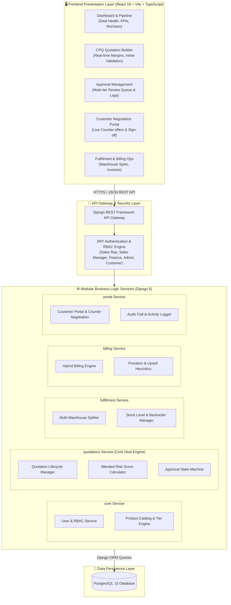
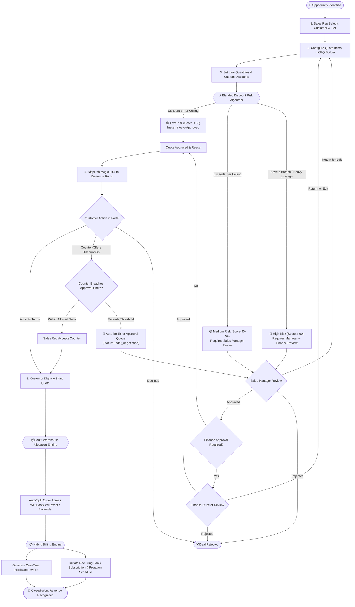
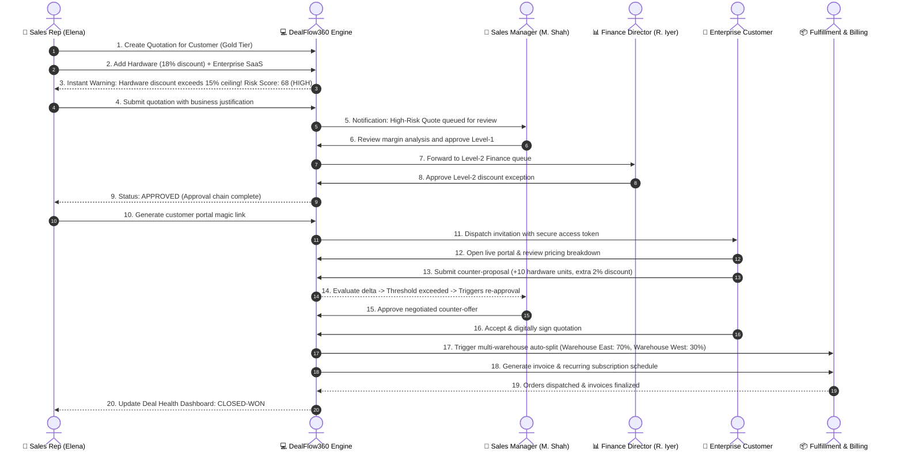
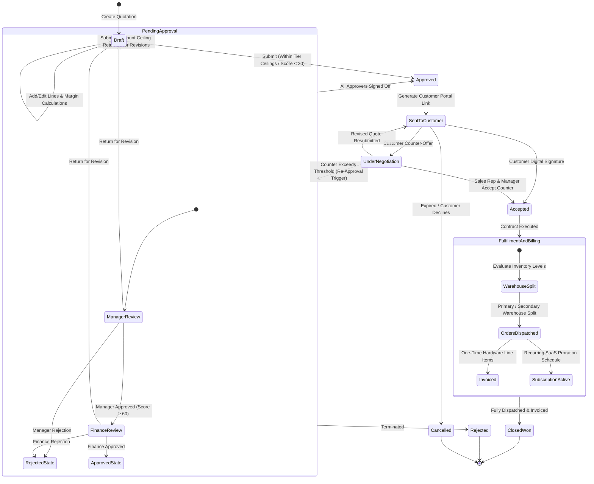
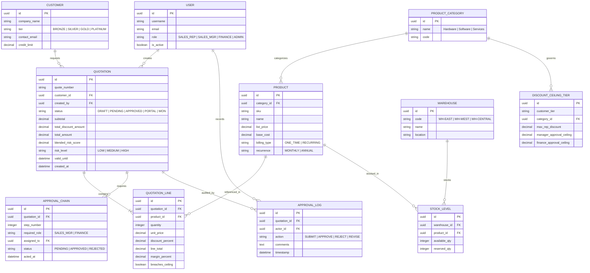

# DealFlow360

**Autonomous Deal Engine for Enterprise Revenue Operations**

[](https://www.python.org/downloads/)
[](https://www.djangoproject.com/)
[](https://react.dev/)
[](https://www.typescriptlang.org/)
[](https://www.postgresql.org/)
[](LICENSE)

---

## Abstract

**DealFlow360** is a self-governing revenue operations platform designed to automate and enforce governance across the quote-to-cash lifecycle. It prevents margin slippage through a proprietary **Blended Discount Risk Score** algorithm, balances multi-warehouse fulfillment based on real-time stock levels, unifies one-time hardware purchases and recurring subscription billing on a single order, and replaces slow negotiation emails with an interactive, live **Customer Negotiation Portal** with automated re-approval triggers.

---

## Key Capabilities

- **Intelligent Discount Governance**: Evaluates quotations using a multi-dimensional blended risk scoring algorithm that detects per-line ceiling breaches and cumulative margin erosion across mixed categories.
- **Dynamic Multi-Tier Approvals**: Auto-routes deals based on risk profiles: instant auto-approval for low risk, Sales Manager sign-off for medium risk, and dual Sales Manager + Finance Controller approval for high-risk deals.
- **Enterprise CPQ Quotation Builder**: Real-time margin calculation, live discount constraint feedback, catalog search, and inline summary cards with running totals.
- **Multi-Warehouse Auto-Split Fulfillment**: Real-time inventory evaluation that intelligently splits orders across fulfillment nodes (e.g., East Coast, West Coast, Backorder) to maximize delivery speed and minimize logistics cost.
- **Hybrid Billing & Mid-Cycle Proration**: Unifies one-time capital expenditures with monthly/annual SaaS recurring schedules, supporting mid-cycle co-terming and proration.
- **Interactive Customer Negotiation Portal**: Secure tokenized portal where enterprise clients inspect line items, leave feedback, and counter-propose pricing or quantities. Breaches automatically re-enter the approval pipeline.
- **Deal Health & Anomaly Analytics**: Pipeline monitoring tracking deal velocity, discount anomalies, approval bottlenecks, and margin health.

---

## System Architecture



---

## End-to-End Product & Deal Flow

The complete journey of an enterprise deal from creation to fulfillment and revenue recognition:



---

## User Flow & Multi-Role Interaction Journey

Demonstrating the collaborative sequence between Sales Rep, Deal Engine, Management, Finance, Customer, and Operations:



---

## Quotation Lifecycle & Data State Machine

State transitions governed by the core state engine with strict rollback rules:



---

## Data Communication & Entity-Relationship Model



---

## Directory Structure

```
DealFlow360/
├── backend/
│   ├── manage.py
│   ├── requirements.txt
│   ├── dealflow360/                   # Django project configuration
│   │   ├── settings.py                # Installed apps, DB, JWT, CORS
│   │   ├── urls.py                    # Root API router
│   │   ├── wsgi.py
│   │   └── asgi.py
│   ├── core/                          # User Auth, Roles, Products, Customers
│   │   ├── models.py                  # User, Role, ProductCategory, Product, Customer
│   │   ├── serializers.py
│   │   ├── views.py                   # JWT Auth, Catalog endpoints
│   │   ├── urls.py
│   │   └── admin.py
│   ├── quotations/                    # Core Quotation Engine & Risk Scoring
│   │   ├── models.py                  # Quotation, LineItems, DiscountTiers, ApprovalChain
│   │   ├── services/
│   │   │   └── risk_score.py          # Blended Discount Risk Algorithm
│   │   ├── serializers.py
│   │   ├── views.py                   # CRUD, Submit, Approve, Reject, Return
│   │   ├── urls.py
│   │   ├── admin.py
│   │   └── management/commands/
│   │       └── seed_data.py           # Demo users, products, rules seed
│   ├── fulfillment/                  # Multi-Warehouse Auto-Split & Stock
│   │   ├── models.py                  # Warehouse, StockLevel, SplitOrder
│   │   └── ...
│   ├── billing/                      # Subscriptions, Proration, Upsell
│   │   ├── models.py                  # SubscriptionPlan, Invoices, Proration
│   │   └── ...
│   └── portal/                       # Customer Negotiation Portal
│       ├── models.py                  # PortalToken, CounterOffers
│       └── ...
├── frontend/
│   ├── package.json
│   ├── vite.config.ts
│   ├── index.html
│   └── src/
│       ├── main.tsx
│       ├── router.tsx                 # Client routing & protected routes
│       ├── types.ts                   # Unified TypeScript interfaces
│       ├── api/                       # API clients with JWT injection
│       │   ├── client.ts
│       │   ├── auth.ts
│       │   └── quotations.ts
│       ├── lib/                       # Utilities & React Query client
│       │   ├── utils.ts
│       │   └── queryClient.ts
│       ├── styles/
│       │   └── globals.css            # Dark mode tokens & base styles
│       └── features/
│           ├── shell/                 # Navigation, App Shell, Login, Dashboard
│           ├── pipeline/              # Quotation Pipeline List & Filters
│           ├── quotation-builder/     # CPQ Builder with live risk & margin cards
│           ├── approval/              # Approval Review Queue & Detail Page
│           ├── fulfillment/           # Warehouse Split & Allocation
│           ├── billing/               # Invoicing & Subscription Schedules
│           └── portal/                # Customer Negotiation Portal Screen
├── reference/                         # System diagrams, specifications, progress
│   ├── CONTEXT.md                     # Platform specification & data models
│   ├── PROGRESS.md                    # Feature status & changelog
│   ├── DealFlow360_Architecture.md    # Architectural boundaries
│   ├── DealFlow360_Product_Flow.svg   # 18-stage Product Flow Vector
│   └── DealFlow360_Product_Flow.png   # Product Flow Hi-Res Image
├── docker-compose.yml                 # PostgreSQL 15 service definition
├── .env.example                       # Environment configuration template
├── .gitignore
└── README.md
```

---

## Core Algorithm: Blended Discount Risk Score

The core innovation of DealFlow360 is the **Blended Discount Risk Score**. Rather than relying on simple order-level discount averages, DealFlow360 analyzes individual line items against customer-tier matrices and evaluates cumulative margin slippage:

### Algorithm Breakdown

1. **Per-Line Ceiling Matrix**:
   Each product category has an allowable discount limit per customer tier:
   | Customer Tier | Hardware Max Discount | Software Max Discount | Services Max Discount |
   |---|---|---|---|
   | **Platinum** | 20% | 35% | 15% |
   | **Gold** | 15% | 25% | 10% |
   | **Silver** | 10% | 20% | 5% |
   | **Bronze** | 5% | 10% | 0% |

2. **Hard Line Breach Detection**:
   Any single line exceeding its category ceiling by $> 5\%$ immediately flags the quotation for mandatory Sales Manager approval, regardless of overall deal profitability.

3. **Value-Weighted Margin Leakage**:
   Calculates the weighted excess discount relative to line item revenue:
   $$\text{Weighted Leakage} = \sum_{i=1}^N \left( \frac{\text{Line Total}_i}{\text{Quote Total}} \times \max(0, \text{Discount}_i - \text{Ceiling}_i) \right)$$

4. **Composite Risk Classification**:
   - **Score $0 - 29$ (Low Risk)**: Within permissible bounds. Instant approval.
   - **Score $30 - 59$ (Medium Risk)**: Requires Level-1 sign-off by **Sales Manager**.
   - **Score $60 - 100$ (High Risk)**: Requires dual sign-off: Level-1 **Sales Manager** followed by Level-2 **Finance Director**.

---

## Setup & Installation

### Prerequisites

- **Python**: 3.11 or higher
- **Node.js**: 18.x or higher (`npm` 9+)
- **Docker & Docker Compose** (for PostgreSQL)

---

### Step 1: Start PostgreSQL via Docker

```bash
# From the repository root
docker-compose up -d
```

Verify the database container is healthy:
```bash
docker ps
```

---

### Step 2: Backend Setup (Django 5 + DRF)

```bash
cd backend

# Create and activate virtual environment
python -m venv venv

# Windows PowerShell:
.\venv\Scripts\Activate.ps1
# macOS / Linux:
source venv/bin/activate

# Install dependencies
pip install -r requirements.txt

# Apply migrations
python manage.py migrate

# Seed catalog, discount tiers, and demo users
python manage.py seed_data

# Run Django development server
python manage.py runserver
```

The backend will be running at `http://localhost:8000/`.

---

### Step 3: Frontend Setup (React + Vite + TypeScript)

```bash
cd ../frontend

# Install dependencies
npm install

# Start Vite development server
npm run dev
```

The frontend will be available at `http://localhost:5173/`.

---

## Seed Accounts & Access Points

| Portal / Screen | URL | Description |
|---|---|---|
| **Frontend Web App** | `http://localhost:5173` | Main DealFlow360 Single-Page Application |
| **Backend REST API** | `http://localhost:8000/api/` | DRF browsable API root |
| **Django Admin Panel** | `http://localhost:8000/admin/` | Direct database administration |

### Demo Credentials

| Role | Username | Password | Permissions & Views |
|---|---|---|---|
| **Admin** | `admin` | `admin123` | Full superuser access across all apps & admin panel |
| **Sales Rep** | `elena.vance` | `demo123` | Create quotes, CPQ builder, view pipeline |
| **Sales Manager** | `m.shah` | `demo123` | Approve/Reject Tier-1 discounts, view team pipeline |
| **Finance Director** | `r.iyer` | `demo123` | High-risk Tier-2 approval, financial margin audits |

---

## API Documentation

### Authentication (`/api/auth/`)
| Method | Endpoint | Description | Auth Required |
|---|---|---|---|
| `POST` | `/api/auth/login/` | Obtain JWT access and refresh token pair | No |
| `POST` | `/api/auth/refresh/` | Refresh expired access token | No |
| `GET` | `/api/auth/me/` | Fetch active user profile and role | Yes (JWT) |
| `GET` | `/api/auth/products/` | Product catalog with base pricing | Yes (JWT) |
| `GET` | `/api/auth/customers/` | Customer list with tier metadata | Yes (JWT) |

### Quotations & Approvals (`/api/quotations/`)
| Method | Endpoint | Description | Auth Required |
|---|---|---|---|
| `GET` | `/api/quotations/` | List all quotations with risk filters | Yes (JWT) |
| `POST` | `/api/quotations/` | Create a new quotation draft | Yes (JWT) |
| `GET` | `/api/quotations/{id}/` | Detailed quotation view with lines & chain | Yes (JWT) |
| `PATCH` | `/api/quotations/{id}/` | Update quote header (customer, notes) | Yes (JWT) |
| `POST` | `/api/quotations/{id}/lines/` | Add line item to draft | Yes (JWT) |
| `PATCH` | `/api/quotations/{id}/lines/{line_id}/` | Update quantity or discount on a line | Yes (JWT) |
| `DELETE`| `/api/quotations/{id}/lines/{line_id}/` | Remove line item from draft | Yes (JWT) |
| `POST` | `/api/quotations/{id}/submit/` | Submit quote; runs blended risk algorithm | Yes (JWT) |
| `POST` | `/api/quotations/{id}/approve/` | Sign off on approval step (Manager / Finance) | Yes (JWT) |
| `POST` | `/api/quotations/{id}/reject/` | Reject quotation with rejection notes | Yes (JWT) |
| `POST` | `/api/quotations/{id}/return/` | Return quotation to rep for revision | Yes (JWT) |
| `GET` | `/api/quotations/{id}/risk-score/` | Diagnostic breakdown of risk metrics | Yes (JWT) |

---

## License

This project is licensed under the MIT License — see the [LICENSE](LICENSE) file for details.
