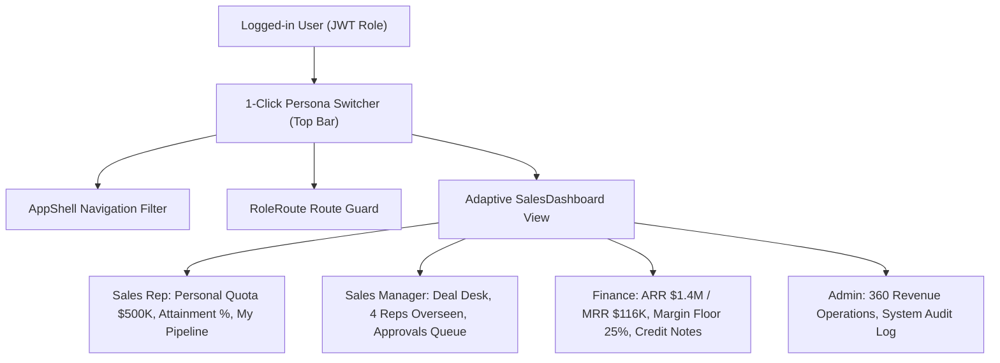

# DealFlow360 — Master Project Context & Audit Manual (AI / Codex Handoff)

> **Purpose**: Give this file to OpenAI Codex, Antigravity, or any engineer to instantly understand the complete DealFlow360 platform, architecture, active codebase, data models, API contracts, security gaps, and resolved edge cases with minimal token usage.

---

## 1. Project Overview & Operational Context
- **Project Name**: DealFlow360 — Self-Governing Enterprise Revenue Operations & CPQ Platform
- **Hackathon Mission**: 18-hour sprint building an Odoo-style self-governing deal engine. Evaluated on real-time business logic, policy governance, warehouse coordination, and customer collaboration.
- **Repository Root**: `d:\Projects\DealFlow360\DealFlow360` *(all commands must execute in this directory)*
- **Git Remote**: `https://github.com/aanandmodi/DealFlow360.git` (`main` branch)
- **Primary Contributor / Author**: `aanandmodi` (`aanandmodi09@gmail.com`)
- **Active Background Dev Servers**:
  - Backend API: Django 5 on `http://localhost:8000`
  - Frontend UI: React 18 / Vite on `http://localhost:5173`

---

## 2. Tech Stack (LOCKED & IMPLEMENTED)
- **Backend**: Python 3.11+ / Django 5.x / Django REST Framework / SimpleJWT
- **Database**: SQLite (dev fallback, fully seeded) / PostgreSQL 15+ (docker-compose ready on port 5432)
- **Auth**: SimpleJWT (Bearer token for internal users) + Tokenized Magic Link (for customer portal)
- **Frontend**: React 18 / TypeScript / Vite / Tailwind CSS / Lucide React / TanStack Query v5
- **Architecture Principle**: Synchronous REST APIs only (no WebSockets). Fast, predictable polling and query invalidation.

---

## 3. Team Responsibilities & Current Completion Status

| Role | Contributor | Django Apps | Frontend Routes / Features | Status |
|---|---|---|---|---|
| **Person A** | `aanandmodi` (You) | `quotations` | `/quotations/new`, `/quotations/:id`, `/approvals`, `/approvals/:id` | **100% COMPLETE** |
| **Person B** | Abhishek-Ag-1112 | `fulfillment`, `billing` | `/fulfillment`, `/subscriptions`, `/invoices`, `<UpsellPanel>` | **100% COMPLETE** |
| **Person C** | Programmer-NITIN | `portal`, `core` | `/dashboard`, `/quotations` (Kanban), `/deal-health`, `/portal/quotations/:token` | **100% COMPLETE** |
| **Integration** | `aanandmodi` | All 5 apps | Dual-compatible models, clean migrations, Windows seed fix, unified API client | **100% COMPLETE** |

---

## 4. How the Role-Specific Dashboard Problem Was Solved

Previously, all logged-in users redirected to a single static dashboard. The teammate implemented a three-tier Role-Based Access Control (RBAC) architecture:

1. **Adaptive Dashboard Views (`SalesDashboard.tsx`)**:
   - **Sales Rep (`sales_rep`)**: Personal Quota target ($500K) and attainment bar, "New Quotation" & "My Pipeline" shortcuts, Rep's own active pipeline metrics, and Personal Deals table.
   - **Sales Manager (`sales_manager`)**: Deal Desk Command Hub, Team Pipeline Overview ($909K active, 9 ops), Approvals Queue shortcut with live pending badge count, Margin Leakage radar, Rep Oversight Breakdown.
   - **Finance (`finance`)**: Revenue & Margin Governance Hub, Subscriptions & ARR run-rate ($1.4M), MRR ($116K), Billing Period (Q1-FY25), Margin Floor (25%), Pending Finance Sign-offs, Invoices & Payments reconciliation.
   - **Admin (`admin`)**: Executive Operations Hub, system-wide metrics, platform health, audit report exporter, backend config shortcuts.
2. **1-Click Persona Switcher (`AppShell.tsx`)**:
   - Mounted directly in the top navigation header bar (`Role:` dropdown).
   - Allows switching live between:
     - Elena Vance (`sales_rep` / `demo123`)
     - M. Shah (`sales_manager` / `demo123`)
     - R. Iyer (`finance` / `demo123`)
     - System Admin (`admin` / `admin123`)
   - Re-authenticates on the fly, clears cache, and transitions the UI without requiring manual logout.
3. **Route Guards (`RoleRoute` in `App.tsx`)**:
   - Restricts sensitive routes (e.g. Sales Reps attempting to access `/approvals` receive an access restricted notice with a link back to their dashboard).

---

## 5. Comprehensive Audit: Built vs. Remaining ([DealFlow360.pdf](file:///d:/Projects/DealFlow360/DealFlow360/reference/DealFlow360.pdf))

Below is the line-by-line audit of the 13-page Odoo hackathon problem statement:

| Section in PDF | Requirement Description | Implementation Status | Current Location / Details |
|---|---|---|---|
| **A1** | **Internal Authentication** (Standard login & signup) | 🟢 **Built** | `LoginPage.tsx`, SimpleJWT tokens on `/api/auth/login/` |
| **A1** | **Customer Portal Access** (Magic link or token) | 🟢 **Built** | `portal/views.py`, `/portal/quotations/:token` |
| **A2** | **Product & Price List Management** (Name, Category, Price, Unit, Tax, Variants, Tier pricing) | 🟡 **Backend Built / UI in Admin** | Modeled in `quotations/models.py` (`Product`, `ProductVariant`, `PriceList`, `PriceListItem`). Managed via Django Admin or seed data. **Frontend `/config` is currently a placeholder**. |
| **A3** | **Discount Tier & Approval Chain Setup** (Ceilings per tier & category, Manager vs. Finance chains) | 🟡 **Backend Built / UI in Admin** | Modeled in `quotations/models.py` (`DiscountTier`, `ApprovalChainRule`). Logic runs live in `risk_score.py`. **Frontend `/config` is currently a placeholder**. |
| **A4** | **Warehouse & Fulfillment Setup** (Warehouses, stock levels, replenishment, freight weighting) | 🟡 **Backend Built / UI in Admin** | Modeled in `fulfillment/models.py` (`Warehouse`, `StockLevel`). Auto-split algorithm uses freight cost weights. **Frontend `/config` is currently a placeholder**. |
| **A5** | **Subscription / Recurring Plan Setup** (Monthly, quarterly, yearly plans, proration, cancellation) | 🟢 **Built** | Modeled in `billing/models.py`. Tested on `/subscriptions` and `/invoices`. Proration logic active on `/api/billing/:line_id/prorate/`. |
| **A6** | **Upsell / Cross-Sell Rule Setup** (Product pairings, promoted tags, minimum margin thresholds) | 🟢 **Built** | `billing/models.py` (`UpsellRule`), rendered dynamically in `UpsellPanel.tsx`. |
| **A7** | **Reporting & Dashboard Configuration** (Sales performance, Period/Rep/Status/Category filters) | 🟡 **Partial** | Executive KPI cards built in `SalesDashboard.tsx`. **The dedicated `/reports` route is currently a placeholder**. |
| **A7** | **Export Options (PDF / XLS)** | 🔴 **Remaining** | PDF mentions "Export options: PDF / XLS". The Admin dashboard has a button, but real client-side or server PDF / CSV export for quotations and reporting is not yet implemented. |
| **B1** | **Sales Workspace Top Menu** (Quotations, Pipeline, Reload Data, Go to Backend) | 🟢 **Built** | `AppShell.tsx` with search, live persona switcher, notifications, and navigation tabs. |
| **B2** | **Quotation List / Pipeline View** (Selectable cards with customer, amount, stage) | 🟢 **Built** | `PipelinePage.tsx` 5-stage drag/view Kanban board and `QuotationListPage.tsx` data table. |
| **B3** | **Quotation Builder Screen** (Pick products, adjust quantities, discount ceilings, live margin indicator) | 🟢 **Built** | `QuotationBuilderPage.tsx` with real-time gross/discount/tax/net and margin indicators. |
| **B4** | **Discount Approval Screen** (Blended risk score, Manager/Finance steps, audit trail, approve/reject/return) | 🟢 **Built** | `ApprovalDetailPage.tsx` with policy breach indicators, memorandum feedback, and full audit logs. |
| **B5** | **Upsell & Cross-Sell Panel** (Ranked suggestions, margin delta, Add to Quote, immediate margin update) | 🟢 **Built** | `UpsellPanel.tsx` embedded in Quotation Builder. |
| **B6** | **Fulfillment & Warehouse Split Screen** (Recommended warehouse split based on stock, manual override) | 🟢 **Built** | `FulfillmentPage.tsx` with cost-optimal allocation table and shipment cost estimations. |
| **B7** | **Subscription & Billing Screen** (One-time vs. recurring lines separated, billing schedule, proration) | 🟢 **Built** | `BillingPage.tsx` with CapEx vs. OpEx separation, invoice history, and proration preview modal. |
| **B8** | **Customer Portal Negotiation Screen** (Line comments, counter-discount field, auto re-approval on threshold breach) | 🟢 **Built** | `PortalNegotiationPage.tsx` with active deal switcher, negotiation thread, and counter-offer slider. |
| **B9** | **Deal Health & Anomaly Dashboard** (Stalled deals >14d, discount anomalies, slippage alerts, 1-click open) | 🟢 **Built** | `DealHealthDashboard.tsx` with interactive anomaly tables and quotation deep links. |
| **Sec 8** | **Deliverables** (Architecture diagram, seed data, demo script, future roadmap) | 🟢 **Built** | `README.md` has 5 Mermaid diagrams, and `TECHNICAL_ROUND_MASTER_GUIDE.md` provides the complete 30+ Q&A judge defense manual. |

---

## 6. What Remains to Reach 100% Production SaaS Perfection

1. **Migrate Database from SQLite to PostgreSQL 15**:
   - Launch Docker container `dealflow360_db` on port `5432` via `docker-compose up -d db`.
   - Update `settings.py` / `.env` to connect to PostgreSQL.
   - Run migrations and seed data on PostgreSQL.
2. **Zero-Leak Enterprise Security & Anti-IDOR Hardening**:
   - Fix `portal_quotations_list` data leak (do not dump all quotes to unauthenticated callers).
   - Enforce DRF permission classes (`IsSalesManagerOrAdmin`, `IsFinanceOrAdmin`, `IsQuotationOwnerOrManager`) on backend endpoints so reps cannot approve their own deals or access other reps' quotes.
   - Add DRF rate limiting (`AnonRateThrottle`, `UserRateThrottle`).
3. **Build Native React UI for System Configuration (`/config`)**:
   - Replace placeholder with tabbed management console for Products & Variants, Price Lists, Customer Tiers & Ceilings, Warehouses & Stock, Subscription Plans, and Upsell Rules.
4. **Build Native React UI for Executive Reporting (`/reports`)**:
   - Replace placeholder with date-range filtered reporting (Today, Week, Month, Custom), Sales Rep filter, Category filter, and approval conversion rates.
5. **Implement PDF & CSV Export Engine**:
   - Add printable branded Quotation PDF download in Quotation Builder.
   - Add CSV / Excel export on Quotations and Reports.
6. **Concurrency & State Machine Locking**:
   - Pessimistic locking (`select_for_update`) during warehouse split acceptance to prevent inventory race conditions.

---

## 7. Unified Data Models & Dual-Compatibility Architecture

All models are harmonized with **dual-compatible properties and aliases** to prevent breakage across any person's frontend or backend conventions:

- **`core.User`**: Custom user (`role`: `admin`, `sales_manager`, `finance`, `sales_rep`, `customer`).
- **`quotations.Customer`**: `name`, `company`, `email`, `phone`, `address`, `tier` (`bronze`, `silver`, `gold`), `user` (FK).
- **`quotations.Product`**: `name`, `sku`, `category` (`hardware`, `services`, `software`, `subscriptions`), `base_price`, `unit`, `tax_pct`, `is_subscription`, `is_active`.
- **`quotations.ProductVariant`**: `product` (FK), `attribute`, `value`, `extra_price`.
- **`quotations.PriceList` & `PriceListItem`**: Customer tier-specific price overrides.
- **`quotations.DiscountTier`**: `tier`, `category`, `max_discount_pct` (aliased as `max_discount_percent`).
- **`quotations.ApprovalChainRule` (aliased as `ApprovalChain`)**: `min_over_pct`, `max_over_pct`, `requires_manager`, `requires_finance`.
- **`quotations.Quotation`**:
  - Fields: `quote_number`, `customer`, `rep`, `status`, `blended_risk_score`, `manager_approved`, `finance_approved`, `payment_terms`, `portal_token`, `notes`, `valid_until`.
  - Dual Compatibility: `sales_rep` $\leftrightarrow$ `rep`, `total_amount` $\leftrightarrow$ `total`, `margin_pct`, `gross_total`, `tax_amount`, `approval_level_display`, `status_display`.
- **`quotations.QuotationLine`**:
  - Fields: `quotation`, `product`, `qty`, `unit_price`, `discount_pct`, `line_limit_pct`, `is_subscription`.
  - Dual Compatibility: `quantity` $\leftrightarrow$ `qty`, `discount_percent` $\leftrightarrow$ `discount_pct`, `net_price`, `gross_total`, `line_total`, `tax_amount`, `category_name`.
- **`quotations.ApprovalLog`**: `quotation`, `action`, `actor`, `role_required`, `note`.
- **`fulfillment.Warehouse`**: `name`, `location`, `shipping_cost_weight`.
- **`fulfillment.StockLevel`**: `warehouse`, `product`, `in_stock`, `reserved`, `available` (property).
- **`fulfillment.FulfillmentSplit`**: `quotation`, `warehouse`, `product`, `qty`, `status`, `promised_ship_date`, `estimated_cost`.
- **`billing.SubscriptionPlan`**: `name`, `product`, `cycle`, `price`, `active`.
- **`billing.Invoice`**: `quotation`, `invoice_number`, `type`, `amount`, `status`, `due_date`.
- **`billing.Payment`**: `invoice`, `amount`, `method`, `reference`, `paid_at`.
- **`billing.UpsellRule`**: `product`, `suggested_product`, `min_margin_pct`, `is_promoted`.
- **`portal.NegotiationMessage`**: `quotation`, `author_type`, `author_name`, `message`, `counter_discount_percent`, `line_ref`.
- **`portal.PortalToken`**: `token`, `email`, `quotation`, `expires_at`, `is_used`.

---

## 8. Complete Active API Surface

### Auth & Portal
- `POST /api/auth/login/` — SimpleJWT authentication (returns `user`, `tokens.access`, `tokens.refresh`)
- `GET  /api/auth/me/` — Current logged-in user profile
- `POST /api/auth/portal/request-magic-link/` — Generate customer magic link token
- `POST /api/auth/portal/verify/` — Validate magic link token

### Quotations & Governance (Person A)
- `GET  /api/quotations/` — List quotations (supports both raw array and `{ count, results }`)
- `POST /api/quotations/create/` or `POST /api/quotations/` — Create new quotation
- `GET  /api/quotations/<pk>/` — Quotation detail with lines and logs
- `POST /api/quotations/<pk>/lines/` — Add line item
- `DELETE /api/quotations/<pk>/lines/<line_id>/` — Delete line item
- `POST /api/quotations/<pk>/submit/` — Trigger blended risk scoring and route for approval
- `POST /api/quotations/<pk>/approve/` — Approve quotation (Manager / Finance)
- `POST /api/quotations/<pk>/reject/` — Reject quotation with reason
- `POST /api/quotations/<pk>/return/` — Return quotation to draft with feedback
- `POST /api/quotations/<pk>/confirm/` — Confirm approved quotation for fulfillment
- `GET  /api/quotations/<pk>/risk-score/` — Breakdown of risk score, per-line ceilings, and overage
- `GET  /api/quotations/<pk>/logs/` — Full audit trail of quotation actions
- `GET  /api/quotations/discount-tiers/` — Discount tier ceilings catalog
- `GET  /api/quotations/pipeline-summary/` — Pipeline metrics for KPI cards
- `GET  /api/customers/` — Customers catalog
- `GET  /api/products/` — Products catalog with variants and active status

### Fulfillment & Inventory (Person B)
- `POST /api/fulfillment/<quotation_id>/suggest-split/` — Greedy multi-warehouse split suggestion
- `POST /api/fulfillment/<quotation_id>/accept-split/` — Lock and commit warehouse allocation
- `POST /api/fulfillment/<quotation_id>/override-split/` — Manual logistics override

### Billing & Subscriptions (Person B)
- `GET  /api/billing/<quotation_id>/schedule/` — Split schedule into one-time vs recurring invoices
- `POST /api/billing/<line_id>/prorate/` — Mid-cycle upgrade proration calculator
- `POST /api/billing/<line_id>/cancel/` — Cancel subscription line with credit note
- `GET  /api/quotations/<quotation_id>/upsell-suggestions/` — High-margin cross-sell rules

### Customer Portal Negotiation (Person C)
- `GET  /api/portal/quotations/<token>/` — Public tokenized magic-link quotation inspection
- `POST /api/portal/quotations/<pk>/comment/` — Post line-item negotiation comment
- `POST /api/portal/quotations/<pk>/counter-discount/` — Submit counter-offer discount %
- `POST /api/portal/quotations/<pk>/confirm/` — Customer formal digital acceptance

### Deal Health & Executive Analytics (Person C)
- `GET  /api/dashboard/summary/` — High-level revenue operations metrics
- `GET  /api/dashboard/stalled-deals/` — Deals idle >14 days without customer activity
- `GET  /api/dashboard/anomalies/` — Unusually high discounts or margin erosion outliers
- `GET  /api/dashboard/slippage/` — Fulfillment depot delivery delay forecasts

---

## 9. Pre-Seeded Demo Credentials

| Role | Username | Password | Key Characteristics |
|---|---|---|---|
| **Sales Rep** | `elena.vance` | `demo123` | Quota $500K, builds quotes, tests CPQ |
| **Sales Manager** | `m.shah` | `demo123` | Oversees 4 reps, approves deals $\le 10\%$ risk |
| **Finance Officer** | `r.iyer` | `demo123` | 2nd-tier approvals $> 10\%$ risk, ARR/MRR |
| **System Admin** | `admin` | `admin123` | Full superuser access across all modules |
| **Customer Portal** | *No password* | Direct URL: `http://localhost:5173/portal/quotations/Q-1042` |
